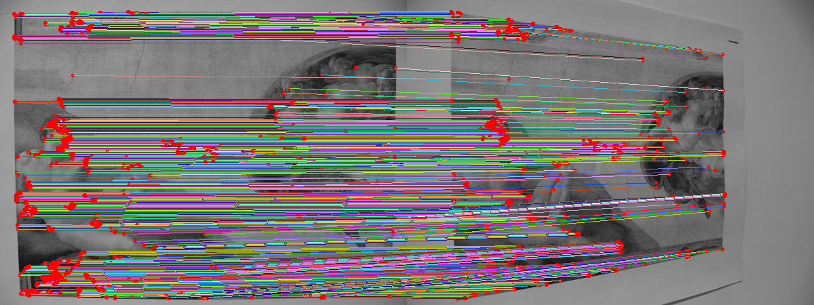

# SiLK - Simple Learned Keypoints

SiLK is a self-supervised framework for learning keypoints. As described in our [paper](https://arxiv.org/abs/2304.06194) (by [Pierre Gleize](https://gleize.github.io/index.html), [Weiyao Wang](https://sites.google.com/view/weiyaowang/home) and [Matt Feiszli](https://scholar.google.com/citations?user=A-wA73gAAAAJ&hl=en&oi=sra)), SiLK focuses on *simplicity* and *flexibility*, while also providing state-of-art and competitive results on existing benchmarks.

<p float="middle">
  
  
</p>

Pre-trained models are also provided.

## Requirements
* [conda](https://www.anaconda.com/) should be installed in order to setup the silk environment.


## Installation

```bash
conda env create -f environment.yml
conda activate silk
```

## Inference

An example of using SiLK for inference is provided in `silk-inference.py`. The pre-trained models and inference parameters are specified in `common.py`.

This can be run with:
```bash
python silk-inference.py
```

The output will be output to `matches.png`.




A very important parameter is the `SILK_DEFAULT_OUTPUT`. It specifies the output(s) that is required from the model. When running the model, it will output a tuple of the same size as `SILK_DEFAULT_OUTPUT`, with the corresponding output at each position.

Valid output names for `SILK_DEFAULT_OUTPUT` are :
* `features` : shared feature map being fed to the keypoint head and descriptor head.
* `logits` : dense output of the keypoint head (pre-sigmoid)
* `probability` : dense output of the keypoint head (post-sigmoid)
* `raw_descriptors` : unnormalized dense descriptors
* `sparse_positions` : positions of keypoints (with confidence value)
* `sparse_descriptors` : descriptors of each keypoints
* `dense_positions` : positions of all pixels
* `dense_descriptors` : descriptors of all pixels

<u>Remark</u> : SiLK will **ONLY** run the minimum required computation to obtain the specified output. Any irrelevant computation will be avoided, in order to keep the computation effcient. For example, if one specifies to output "dense_descriptors" only, the keypoint scoring branch of the model will never be computed.


## Results

The results below have been computed using our VGG-4 backbone (checkpoint [pvgg-4.ckpt](https://dl.fbaipublicfiles.com/silk/assets/models/silk/analysis/alpha/pvgg-4.ckpt) for tab 2,3,6 and [coco-rgb-aug](https://dl.fbaipublicfiles.com/silk/assets/models/silk/coco-rgb-aug.ckpt) for tab 4,5). To reproduce the [IMC2022](https://www.kaggle.com/competitions/image-matching-challenge-2022) results, we also provide the [Kaggle notebook](https://www.kaggle.com/code/piezzo/imc2022-submission-silk/notebook).


<p float="middle">
  
  

</p>
<p float="middle">
    
    
</p>

## Full Documentation

We provide a documentation, but it is non-exhaustive. Please create a new issue if clarification is required regarding some part of the code. We will add documentation if required by the community.

Our documentation can be found [here](doc/silk/index.html).

## Contributions

See the [CONTRIBUTING](CONTRIBUTING.md) file for how to help out.

## License
**SiLK** is licensed under a *GNU General Public License (Version 3)*, as specified in the [LICENSE](LICENSE) file.
